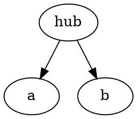

# dot-parser

A reusable [DOT-language](https://graphviz.org/doc/info/lang.html) parser
library for Zig. It parses DOT input and exposes its structure without
performing layout and without depending on any particular graph engine.

> **Status: experimental `0.x`.** Backward compatibility is not promised and
> breaking changes are expected.

## Current support (growing by vertical slices)

The grammar grows one narrow end-to-end slice at a time:



- One root document: `graph` or `digraph`, optionally `strict`, optionally
  named (the source keyword `graph` maps to the library kind `undigraph`;
  in this library `graph` always means "either kind").
- Bare ASCII, numeral, and quoted identifiers (including quoted `+`
  concatenation), node statements, single-edge statements;
  semicolons are optional, as in Graphviz.
- Basic attributes: standalone assignments, graph/node/edge attribute statements,
  and node/edge lists. Duplicate keys and written order are preserved.
- Borrowed source spans, explicit caller memory, fixed-buffer operation.
- Comments (`//`, `/* ... */`, and `#` line comments), skipped without retention.

Everything else (HTML/non-ASCII bare IDs, edge
chains, ports, subgraphs, …) is deliberately deferred to later vertical
slices. The authoritative construct-by-construct table is
[docs/SUPPORTED_SYNTAX.md](docs/SUPPORTED_SYNTAX.md).

See [the attribute example](examples/attributes.zig) for fixed-storage parsing
and ordered attribute traversal. Parsing does not apply defaults or resolve values.

## Usage

### Just parse and check

```zig
const std = @import("std");
const dot = @import("dot_parser");

var bag: dot.FixedDiagnosticBag(16) = .{};
var checked = dot.parseAndValidate(allocator, source, bag.sink(), .{});
defer checked.deinit(allocator);

if (checked.documentValid()) {
    const document = checked.document.?;
    var statements = document.statements();
    while (statements.next()) |statement| {
        switch (statement) {
            .node => |node| std.log.info("node {s}", .{document.text(node.identifier)}),
            .edge => |edge| std.log.info("edge {s} {s} {s}", .{
                document.text(edge.left),
                edge.operator.lexeme(),
                document.text(edge.right),
            }),
            .assignment => |assignment| std.log.info("assignment {s} = {s}", .{
                document.text(assignment.key), document.text(assignment.value),
            }),
            .attribute_statement => |attributes| std.log.info("{s} attributes: {d}", .{
                @tagName(attributes.target), attributes.attributes.len,
            }),
        }
    }
}
```

### Build a linter

`parseBorrowed` and `validate` are separate stages, and the document is a
plain source-ordered view — ranges slice your buffer, and full positions
are derived only when you ask:

```zig
// A tiny lint: flag node names longer than 8 bytes.
var statements = document.statements();
while (statements.next()) |statement| switch (statement) {
    .node => |node| if (node.identifier.len > 8) {
        const where = node.identifier.toSpan(document.source).start;
        std.log.warn("{d}:{d}: long node name '{s}'", .{
            where.line, where.byte_column, document.text(node.identifier),
        });
    },
    .edge, .assignment, .attribute_statement => {}, // This lint only checks nodes.
};
```

### Use fixed memory

For fixed-memory operation, hand `parseBorrowedIn` your own pools — no
allocator, nothing grows, and capacity is visible in the declarations:

```zig
var storage: dot.FixedDocumentStorage(.{
    .statements = 32,
    .nodes = 32,
    .edges = 16,
}) = .{};
var bag: dot.FixedDiagnosticBag(8) = .{};

const parsed = dot.parseBorrowedIn(source, storage.storage(), bag.sink(), .{});
if (parsed.outcome == .success) {
    const validation = dot.validate(&parsed.document.?, bag.sink(), .{});
    _ = validation;
}
// release by reusing or discarding the storage — there is nothing to free
```

(The allocator-based calls also accept arenas and
`std.heap.FixedBufferAllocator` with `document_capacities` hints, if an
allocator fits your architecture better.)

### Integrate a graph engine

Coming in a later slice: a consumer-neutral `DotIR` plus adapter contracts,
so engines consume normalized semantics rather than surface syntax.

### Identifier spelling versus value

`document.text(range)` always returns the exact source spelling, including
quotes and concatenation. Decode explicitly when you need the logical value:

```zig
var value_buffer: [128]u8 = undefined;
const value = try document.decodeIdentifier(node.identifier, &value_buffer);
// Or stream without a decoded-value buffer:
try document.writeIdentifier(node.identifier, writer);
```

Decoding performs no allocation or numeric conversion. See
[ownership and decoding](docs/OWNERSHIP.md#identifier-values) and the runnable
[identifier example](examples/identifiers.zig).

The source bytes are borrowed: keep them alive and unchanged for as long as
the returned document is used. See [examples/](examples/) for runnable
versions of these paths and [docs/BASELINES.md](docs/BASELINES.md) for
measured performance.

## Building

Requires Zig **0.16.0** or newer.

```sh
zig build test        # unit + public integration tests
zig build examples    # build and run the examples
```

The library target has no OS, network, or filesystem dependency: it parses
caller-supplied bytes, so input can come from a file, a pipe, a socket, or
generated in memory — reading it is the application's job.

## Documentation

- Checking whether your DOT files will parse? →
  [Supported DOT syntax](docs/SUPPORTED_SYNTAX.md)
- Deciding who owns what, or working without an allocator? →
  [Ownership and memory](docs/OWNERSHIP.md)
- Handling results, or telling malformed apart from not-yet-supported? →
  [Outcomes and diagnostics](docs/OUTCOMES.md)
- Learning by running code? → [examples/](examples/)
- Performance numbers → [Baselines](docs/BASELINES.md) ·
  Architecture → [Project structure](docs/architecture/PROJECT_STRUCTURE.md) ·
  Release history → [Changelog](CHANGELOG.md)

## License

Licensed under either of

- MIT license ([LICENSE-MIT](LICENSE-MIT))
- Apache License, Version 2.0 ([LICENSE-APACHE](LICENSE-APACHE))

at your option (`MIT OR Apache-2.0`).

Unless you explicitly state otherwise, any contribution intentionally
submitted for inclusion in this work by you shall be dual licensed as above,
without any additional terms or conditions.
