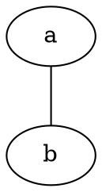

# dot-parser

A reusable [DOT-language](https://graphviz.org/doc/info/lang.html) parser
library for Zig. It parses DOT input and exposes its structure without
performing layout and without depending on any particular graph engine.

> **Status: experimental `0.x`.** Backward compatibility is not promised and
> breaking changes are expected.

## First goal (in progress)

One narrow end-to-end vertical slice before broadening the grammar:



- Exactly one anonymous root `graph` document (the source keyword `graph`
  maps to the library kind `undigraph`).
- Bare ASCII identifiers, node statements, single-edge statements,
  semicolons.
- Borrowed source spans, explicit caller memory, fixed-buffer operation.

Everything else (`digraph`, `strict`, graph names, comments, quoted/numeral/
HTML IDs, attributes, edge chains, ports, subgraphs, …) is deliberately
deferred to later vertical slices — see
[docs/architecture/IMPLEMENTATION_PLAN.md](docs/architecture/IMPLEMENTATION_PLAN.md).

## Building

Requires Zig **0.16.0** or newer.

```sh
zig build test        # unit + public integration tests
zig build examples    # build and run the examples
```

The library target has no OS, network, or filesystem dependency: it parses
caller-supplied bytes, so input can come from a file, a pipe, a socket, or
generated in memory — reading it is the application's job.

## Design documents

- [docs/architecture/IMPLEMENTATION_PLAN.md](docs/architecture/IMPLEMENTATION_PLAN.md)
- [docs/architecture/PROJECT_STRUCTURE.md](docs/architecture/PROJECT_STRUCTURE.md)

## License

Licensed under either of

- MIT license ([LICENSE-MIT](LICENSE-MIT))
- Apache License, Version 2.0 ([LICENSE-APACHE](LICENSE-APACHE))

at your option (`MIT OR Apache-2.0`).

Unless you explicitly state otherwise, any contribution intentionally
submitted for inclusion in this work by you shall be dual licensed as above,
without any additional terms or conditions.
