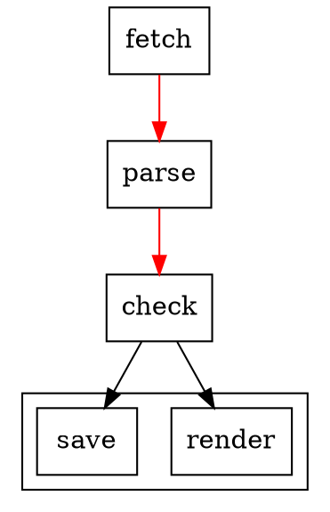

# dot-parser

A parser for the [DOT graph language](https://graphviz.org/doc/info/lang.html),
the text format used by Graphviz, written in Zig.

It reads DOT text and gives you its structure: nodes, edges, attributes and
subgraphs. It also gives clear error messages. It does not draw graphs or
compute layouts. You decide what to build on top, for example a linter, a
formatter, or a converter into your own graph type.

The package has two independent modules:

- **`dot_parser`** parses DOT.
- **`markup_parser`** parses HTML-like markup, such as Graphviz's
  `label=<<b>Hi</b>>` labels. It can check labels while DOT is parsed, or work
  on its own with no DOT at all. It defaults to Graphviz vocabulary checks;
  select [structural mode](docs/MARKUP.md) for custom markup vocabulary.

> **Status: experimental (0.x).** It works and is well tested, but names may
> still change between versions. Breaking changes are listed in the
> [changelog](CHANGELOG.md).


```dot
digraph Pipeline {
    node [shape=box];
    fetch -> parse -> check [color=red];
    subgraph cluster_output { render; save }
    check -> { render save }
}
```

## Highlights

- **Helpful errors.** Each problem points at the exact spot, explains what is
  wrong, and often suggests a fix. Parsing keeps going after an error, so you
  see more than one problem at a time.
- **You choose where memory comes from.** Use any allocator, an arena, or
  fixed buffers with no heap allocation at all.
- **Runs anywhere.** No dependencies, no OS calls, no file access. It builds
  for embedded targets and WebAssembly.
- **Keeps what was written.** Spelling, order and duplicates are kept exactly.
  Nothing is silently rewritten or interpreted.
- **Supports safe handling of untrusted input.** Parsing uses no recursion and
  makes one pass over the input. Limits are off by default, so you set
  explicit budgets for size, nesting and memory, and can parse step by step
  with cancellation.
- **Configurable.** Strict by default, with a lenient mode and optional
  extra checks.
- **HTML-like markup, inside DOT or on its own.** Check the inside of labels
  such as `label=<<b>Hi</b>>` while parsing DOT, or parse HTML-like markup by
  itself.
- **Bring your own processor.** Swap in your own label checker at compile time.
  Its settings plug into the same settings system as DOT's.

## A quick look

```zig
const std = @import("std");
const dot = @import("dot_parser");

pub fn main(init: std.process.Init) !void {
    const allocator = init.gpa;
    var buffer: [4096]u8 = undefined;
    var stdout_writer: std.Io.File.Writer = .init(.stdout(), init.io, &buffer);
    const stdout = &stdout_writer.interface;
    defer stdout.flush() catch {};

    const source =
        \\digraph {
        \\    a -> b;
        \\    b -> c [color=red];
        \\}
    ;

    // Problems are collected here instead of being printed or thrown.
    var bag = dot.GrowableDiagnosticBag.init(allocator, .{});
    defer bag.deinit();

    // Parse the text, then check it (for example, `--` inside a digraph).
    var result = dot.parseAndValidate(allocator, source, bag.sink(), .{});
    defer result.deinit(allocator);

    if (!result.documentValid()) {
        for (bag.items(), 1..) |problem, number| {
            try dot.console.renderBoxed(problem, number, .{ .source = source, .source_name = "graph.dot" }, stdout);
        }
        return;
    }

    const document = result.document.?;
    var edges = document.edgeIterator();
    while (edges.next()) |edge| {
        // An edge end is a node or a whole subgraph (`a -> { b c }`).
        if (edge.left != .node or edge.right != .node) continue;
        const from = document.nodeReference(edge.left.node).?.identifier;
        const to = document.nodeReference(edge.right.node).?.identifier;
        try stdout.print("{s} {s} {s}\n", .{
            document.text(from), edge.operator.lexeme(), document.text(to),
        });
    }
}
```

This prints:

```text
a -> b
b -> c
```

If line 3 said `b -- c` instead (an undirected edge in a directed graph), you
would get:

```text
┌─ Error 1: edge operator does not match the graph kind
│ graph.dot:3:7
│
│ 1 │ digraph {
│   │ ─────── the document is directed because of this keyword
│ ⋯
│ 3 │     b -- c [color=red];
│   │       ^^ expected '->', found '--'
│
│ Hint: change '--' to '->', or declare the document with 'graph'
│ Fix: replace '--' with '->' (one possible repair)
└─ E1 ─ [dot_parser:E.Validation.Operator.002]
```

This program is [examples/quick_start.zig](examples/quick_start.zig).
[Getting started](docs/GETTING_STARTED.md) walks through it step by step.

## Install

You need Zig **0.16.0**. Add the package to your project:

```sh
zig fetch --save git+https://github.com/AshutoshMahala/dot-parser#v0.4.0
```

Then import the modules you need in your `build.zig`:

```zig
const dot_parser = b.dependency("dot_parser", .{ .target = target, .optimize = optimize });
exe.root_module.addImport("dot_parser", dot_parser.module("dot_parser"));
// Only if you check labels or parse markup:
exe.root_module.addImport("markup_parser", dot_parser.module("markup_parser"));
```

These docs and examples target 0.4.0. To follow the development branch instead,
replace `#v0.4.0` with `#main`. See the [changelog](CHANGELOG.md) for changes
and breaking API updates.

## What it understands

All of DOT's statement syntax:

- `graph` and `digraph` documents, with optional `strict` and a name
- Nodes, edges, and edge chains (`a -> b -> c`)
- Attributes: `[color=red]` lists, `node [shape=box]` defaults, and `rankdir=LR`
- Subgraphs, named or not, nested, and as edge ends (`a -> { b c }`)
- Ports (`a:out`, `a:out:n`)
- Every kind of name: plain words (including non-ASCII), numbers,
  `"quoted strings"` joined with `+`, and HTML-like `<...>` labels
- Comments (`//`, `/* */`, `#`) and optional semicolons

See [supported syntax](docs/SUPPORTED_SYNTAX.md) for the full list and the
few places where it differs from Graphviz.

## What it does not do

It reports what the file says. It does not work out what the file means:

- It doesn't lay out or draw anything.
- It doesn't interpret attribute values. `color=red` is just two pieces of text.
- It doesn't apply defaults. `node [shape=box]` stays a statement; it isn't
  copied onto each node.
- It doesn't expand `a -> { b c }` into two edges, merge repeated subgraphs,
  or build a list of unique nodes.
- It doesn't read files. You pass it bytes.
- It doesn't keep comments, so it can't reformat a file on its own.

You can do all of these on top of the parsed document.
[Why it works this way](docs/DESIGN.md) explains these choices.

## Documentation

**DOT**

| Guide | Read it when you want to… |
| --- | --- |
| [Getting started](docs/GETTING_STARTED.md) | parse your first DOT file and read the result |
| [Reading a parsed graph](docs/READING_DOCUMENTS.md) | walk nodes, edges, attributes, ports and subgraphs |
| [Supported syntax](docs/SUPPORTED_SYNTAX.md) | check exactly which DOT input is accepted |
| [DOT error codes](docs/ERRORS.md#dot-error-codes) | look up a DOT error or warning |

**Markup**

| Guide | Read it when you want to… |
| --- | --- |
| [Checking HTML-like labels](docs/LABELS.md) | check `<...>` labels inside DOT files |
| [Parsing markup on its own](docs/MARKUP.md) | parse HTML-like markup without DOT, or check many fragments |
| [Bringing your own processor](docs/CUSTOM_PROCESSORS.md) | plug your own label checker into DOT parsing |
| [Markup error codes](docs/ERRORS.md#markup-error-codes) | look up a markup error or warning |

**Both parsers**

| Guide | Read it when you want to… |
| --- | --- |
| [Errors and diagnostics](docs/ERRORS.md) | show errors, understand results, or apply suggested fixes |
| [Memory](docs/MEMORY.md) | use an arena or fixed buffers, or work with no allocator at all |
| [Settings](docs/POLICIES.md) | make parsing stricter or more lenient, add checks, or set limits |
| [Parsing in small steps](docs/EXECUTION.md) | spread parsing over time, or cancel it |

**Project**

| Guide | Read it when you want to… |
| --- | --- |
| [Why it works this way](docs/DESIGN.md) | understand the main design decisions |
| [Roadmap](docs/ROADMAP.md) | see what is planned but not built yet |
| [Performance](docs/PERFORMANCE.md) | see measured speed and memory use |
| [Architecture](docs/ARCHITECTURE.md) | find your way around the source code |

The same index is in [docs/README.md](docs/README.md).

## Examples

Small runnable programs in [examples/](examples/). `zig build examples` builds
and runs them all, and installs each one in `zig-out/bin/`.

| Example | Shows how to… | Guide |
| --- | --- | --- |
| [quick_start](examples/quick_start.zig) | parse, show problems, and list edges | [Getting started](docs/GETTING_STARTED.md) |
| [parse_undigraph](examples/parse_undigraph.zig) | print every kind of statement | [Getting started](docs/GETTING_STARTED.md) |
| [identifiers](examples/identifiers.zig) | get the real value of a quoted or joined name | [Reading](docs/READING_DOCUMENTS.md#names-spelling-versus-value) |
| [attributes](examples/attributes.zig) | read attribute lists, defaults and assignments | [Reading](docs/READING_DOCUMENTS.md#attributes) |
| [edge_chains](examples/edge_chains.zig) | walk chains like `a -> b -> c` | [Reading](docs/READING_DOCUMENTS.md#edges) |
| [ports](examples/ports.zig) | read ports like `a:out:n` | [Reading](docs/READING_DOCUMENTS.md#nodes-and-ports) |
| [subgraphs](examples/subgraphs.zig) | walk subgraphs and their contents | [Reading](docs/READING_DOCUMENTS.md#subgraphs) |
| [subgraph_endpoints](examples/subgraph_endpoints.zig) | handle edges that end at a subgraph | [Reading](docs/READING_DOCUMENTS.md#edges) |
| [diagnostics_demo](examples/diagnostics_demo.zig) | print problems with source lines and color | [Errors](docs/ERRORS.md#printing-diagnostics) |
| [check_file](examples/check_file.zig) | build a command-line checker for `.dot` files | [Errors](docs/ERRORS.md) |
| [fixed_buffer](examples/fixed_buffer.zig) | parse with no allocator at all | [Memory](docs/MEMORY.md#option-3-fixed-buffers-no-allocator) |
| [policies](examples/policies.zig) | use checks, lenient mode, graph kinds and run-time settings | [Settings](docs/POLICIES.md) |
| [bounded](examples/bounded.zig) | parse in small steps, and cancel | [Small steps](docs/EXECUTION.md) |
| [composed_markup](examples/composed_markup.zig) | check every label while parsing DOT | [Labels](docs/LABELS.md#check-every-label-while-parsing) |
| [delayed_markup](examples/delayed_markup.zig) | check only the labels you choose | [Labels](docs/LABELS.md#check-the-labels-you-choose) |
| [markup](examples/markup.zig) | parse and validate markup on its own | [Markup](docs/MARKUP.md) |
| [graphviz_vocabulary](examples/graphviz_vocabulary.zig) | check Graphviz tag and attribute vocabulary (unreleased; not full label grammar) | [Vocabulary](docs/MARKUP.md#graphviz-vocabulary) |
| [custom_processor](examples/custom_processor.zig) | plug in your own label checker | [Own processor](docs/CUSTOM_PROCESSORS.md) |

## Building and testing

```sh
zig build test                 # all tests
zig build examples             # build and run every example
zig build check-freestanding   # compile for RISC-V32 and Wasm32
zig build bench -Doptimize=ReleaseFast   # main benchmark
```

## License

Licensed under either of

- MIT license ([LICENSE-MIT](LICENSE-MIT))
- Apache License, Version 2.0 ([LICENSE-APACHE](LICENSE-APACHE))

at your option (`MIT OR Apache-2.0`).

The optional console renderer uses Unicode-derived width tables under the
Unicode License v3. The full notice is in
[console_widths.zig](src/common/console_widths.zig).

Unless you explicitly state otherwise, any contribution intentionally
submitted for inclusion in this work by you shall be dual licensed as above,
without any additional terms or conditions.
