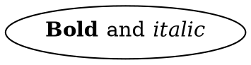

# Checking HTML-like labels

Graphviz lets you write labels in a small HTML-like language:



This page shows how to check what is inside those labels while you parse DOT
files. To parse HTML-like markup without DOT, see
[Parsing markup on its own](MARKUP.md).

> **Development version only.** Label checking and the `markup_parser` module
> are not part of the 0.3.0 release.

## What happens by default

The DOT parser keeps `<...>` values exactly as written and doesn't look
inside. It finds where a value ends the same way Graphviz does: by counting `<`
and `>` until they balance. These values can appear anywhere a name can, not
just in `label`.

So by default `label=<<b>Bold</i>>` parses without complaint, because nobody
checked the tags. You have three choices:

| You want to… | Do this |
| --- | --- |
| Keep labels as they are, unchecked | Nothing. This is the default (`markup = .passthrough`). |
| Reject HTML-like values entirely | Set `markup = .none` in the [settings](POLICIES.md#all-dot-settings). They are reported as unsupported. |
| Check what is inside | Use one of the two ways below. |

## Two ways to check labels

| | Check every label while parsing | Check the labels you choose, afterwards |
| --- | --- | --- |
| How | Add a label checker to your DOT profile | Parse DOT, then pass selected values to the markup parser |
| Which values | Every `<...>` value in the file | Only the ones your code picks, such as `label` |
| Diagnostics | One bag for DOT and labels together | Your choice of bag, separate from DOT's |
| Label trees | Checked, then discarded | Kept, if you want them |
| Memory | Allocator | Allocator or fixed buffers |
| Best for | "Is this whole file OK?" | Tools that need control or the parsed labels |

Both report errors at their real line and column in the DOT file.

## Check every label while parsing

Give your DOT profile a label checker. Every HTML-like value is then checked
during the same parse:

```zig
const dot = @import("dot_parser");
const markup = @import("markup_parser");

const Parser = dot.Profile(.{
    .processors = .{ .markup = markup.Profile(.{}) },
});

var bag = Parser.GrowableDiagnosticBag.init(allocator, .{});
defer bag.deinit();
var result = try Parser.parseAndValidate(allocator, source, bag.sink(), .{});
defer result.deinit(allocator);

if (!result.documentValid()) {
    const locations = try allocator.alloc(dot.location.Location,
        try Parser.console.locationCapacity(bag.items()));
    defer allocator.free(locations);
    try Parser.console.renderBoxedList(bag.items(), 0, .{ .source = source }, locations, writer);
}
```

The result has two parts:

- `result.dot`: the ordinary DOT result, including the document. You still get
  the DOT document even when a label is wrong.
- `result.markup`: a summary of the labels: how many were checked
  (`visited`), how many were fine (`valid`), and whether every label was
  reached (`complete`).

`result.documentValid()` is true only when the DOT and every label are fine.

Errors inside labels look like any other error, at their place in the DOT file:

```text
┌─ Error 1: repeated attribute name on one element
│ example.dot:1:36
│
│ 1 │ digraph { a [label=<<b title='one' title='two'>Hello</b>>]; …
│   │                        ──┬──       ^^^^^ same name as the earlier attribute
│   │                          └──── first attribute with this name
│
│ Hint: keep one attribute with the intended value, or change the duplicate-attribute policy
└─ E1 ─ [markup_parser:E.Validation.Attribute.006]
```

`parseAndValidate`'s last argument groups options for each side:

| Option | What it holds |
| --- | --- |
| `.dot` | The ordinary DOT options: run-time `.policy`, size hints in `.parse`, validation scratch in `.validation`, `.cancellation` |
| `.markup` | The label checker's options, such as a run-time `.policy` |
| `.markup_resources` | Resources for the label checker, such as `.scratch_allocator` |

Good to know:

- DOT and label settings are separate. Give each its own limits, as in the
  [composed example](../examples/composed_markup.zig).
- If DOT collects errors (the default), a bad label doesn't stop the rest of
  the file being checked. If DOT is set to fail fast, it stops after the first
  bad label, once that label has been fully checked.
- Label findings arrive when the parser reaches each label, before DOT's
  validation findings. See [order of diagnostics](ERRORS.md#order-of-diagnostics).
- This mode runs to completion. It can't run in [small steps](EXECUTION.md) yet.
- The checker reuses one set of buffers for all labels. That avoids thousands
  of small allocations, but the buffers stay as big as the largest label until
  the parse ends.

## Check the labels you choose

For more control, parse the DOT first, then check the values you pick:

```zig
const Labels = markup.Profile(.{ .policy = markup.presets.untrusted });
const ready = Labels.prepare(.{}); // prepare once, reuse for every label

labels: for (document.attributes) |attribute| {
    if (!std.mem.eql(u8, document.text(attribute.key), "label")) continue;

    // A value can join several parts with `+`, so look at each part.
    var parts = try dot.identifier.parts(source, attribute.value);
    while (parts.next()) |part| {
        if (part.form != .html) continue;
        var checked = try ready.parseAndValidate(allocator, try part.fragment(source), bag.sink(), .{});
        defer checked.deinit();
        // checked.parse.document is this label's tree, if it parsed.
        if (checked.shouldStop(.collect)) break :labels; // stop the whole batch
    }
}
```

- `dot.identifier.parts` splits a value like `<<b>x</b>> + " text"` into its
  parts. `part.form` is `.html` for `<...>` parts.
- `part.fragment(source)` remembers where the part sits in the DOT file, so
  errors point at the right place.
- `checked.shouldStop(...)` says whether to stop checking labels
  **altogether**. It is true after a cancel, a full bag, or a memory or buffer
  failure, so break out of every loop, not just the inner one. Pass
  `.fail_fast` instead of `.collect` to also stop at the first label with
  errors.

Other ways to run each check:

- To avoid allocating for every label, use one reusable
  [workspace](MARKUP.md#checking-many-fragments).
- To use fixed buffers instead of an allocator, call
  `ready.parseAndValidateIn(...)`.

The table of result fields is in
[checking many fragments](MARKUP.md#checking-many-fragments).

## Use your own checker

Instead of `markup.Profile(...)`, you can bind your own label processor, for
example one that only allows Graphviz's tags, or one for a different dialect.
See [Bringing your own processor](CUSTOM_PROCESSORS.md).

## Examples

- [composed_markup.zig](../examples/composed_markup.zig): check every label
  while parsing, with one bag
- [delayed_markup.zig](../examples/delayed_markup.zig): check only `label`
  values after parsing
- [custom_processor.zig](../examples/custom_processor.zig): bind your own label
  checker

Run them with `zig build examples`. Each program is also installed in
`zig-out/bin/`.

## Not available yet

- Checking labels against Graphviz's list of allowed tags
- Checking labels in small steps, or with one budget for DOT and its labels

See the [roadmap](ROADMAP.md).
