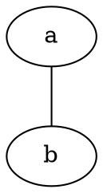

# Implementation Plan

Status: ready for milestone 0  
Date: 2026-07-15

## Objective

Deliver one narrow end-to-end DOT slice before broadening the grammar:



The source keyword `graph` maps to the library kind `undigraph`.

The slice is intentionally small, but it must exercise the permanent
architecture:

```text
raw bytes -> lexer -> parser events -> borrowed syntax tree -> validation
```

## Milestone 1 scope

### Supported

- Exactly one anonymous root `graph` document.
- Bare ASCII identifiers.
- Node statements.
- Single-edge statements.
- `--` as the valid undigraph operator.
- Recognition and retention of `->` so validation can report every mismatched
  operator in the document.
- Semicolons.
- Spaces, tabs, LF, CRLF, and CR.
- Borrowed source spans.
- Byte offset, physical line, and byte-column diagnostics.
- Explicit caller memory and fixed-buffer operation.
- Fail-fast structural parsing.
- Complete, bounded validation diagnostics.

### Deliberately deferred

- `digraph` root documents.
- Graph names and `strict`.
- Optional semicolons.
- Comments.
- Quoted, numeral, and HTML-like IDs.
- Attributes and assignments.
- Edge chains.
- Ports and compass points.
- Subgraphs.
- Syntax recovery.
- UTF-8 validation and transcoding.
- `DotIR`, serialization, and engine adapters.
- Public syntax-sink API.
- Pull/pump drivers, incremental parsing, and internal threading.

## Milestone 0: Repository scaffold

1. Add `build.zig` and `build.zig.zon` with the minimum supported Zig version
   documented in the README.
2. Add `src/root.zig`, an empty public test target, and one example target.
3. Add MIT and Apache-2.0 license texts and `MIT OR Apache-2.0` package metadata.
4. Configure `zig build test` to run unit and public integration tests.
5. Add a minimal README containing the experimental `0.x` status and the first
   supported subset.

Exit condition:

```text
zig build test
```

passes with the empty package scaffold and no network or OS dependency in the
library target.

## Milestone 1 tasks

### Step 1: Source positions

Implement:

```zig
const Location = struct {
    byte_offset: usize,
    line: usize,
    byte_column: usize,
};

const Span = struct {
    start: Location,
    byte_len: usize,
};
```

Decide and test whether the first line and column are zero- or one-based. Byte
offset should remain zero-based. Treat CRLF as one physical newline while
advancing the byte offset by two.

Tests:

- Empty source.
- LF, CRLF, and CR.
- Tabs advance canonical byte column by one.
- Location after every byte boundary.

### Step 2: WDP diagnostic primitives

Create the first provisional diagnostic registry:

```text
E.DotParser.Syntax.001    unexpected token
E.DotParser.Syntax.002    unexpected end of input
E.DotParser.Validation.001 directed operator in undigraph
E.DotParser.Profile.001   recognized but unsupported feature
B.DotParser.Resource.001 output capacity exhausted
```

Exact sequence assignments may change during `0.x`, but they must be unique,
documented, and testable. Implement:

- Typed diagnostic code/identity.
- Location or span.
- Small typed context fields without preformatted strings.
- Direct diagnostic sink.
- Fixed-capacity diagnostic bag.

Do not add catalogs, localization, JSON, or runtime compact-ID hashing yet.

### Step 3: Raw-byte lexer

Implement tokens:

```zig
const TokenTag = enum {
    keyword_graph,
    identifier,
    edge_undirected,
    edge_directed,
    left_brace,
    right_brace,
    semicolon,
    eof,
};
```

Requirements:

- Borrow spans from the original input.
- Perform no allocation.
- Track the token's starting location.
- Recognize only the milestone subset.
- Distinguish invalid syntax from a recognized deferred feature where the small
  detector exists.
- Always make progress or return a terminal result.

Tests:

- One test per token.
- Keyword boundary: `graphical` is an identifier, not `graph` + identifier.
- Every whitespace and newline combination.
- Truncation at each byte of `--`, `->`, and `graph`.
- Invalid and unsupported leading bytes.

### Step 4: Private syntax-event contract

Define the minimum provisional event vocabulary required by the syntax builder:

```text
begin document
node statement
edge statement
end document
abort document
```

Document:

- Event ordering.
- Borrowed-span lifetime.
- Sink error propagation.
- Begin/commit/abort behavior.
- Whether a sink may retain spans without copying the source.

Do not publish a general engine target or runtime-erased sink.

### Step 5: Parser state machine

Implement the milestone grammar:

```text
document  := "graph" "{" statement* "}" EOF
statement := identifier ";"
           | identifier edgeop identifier ";"
edgeop    := "--" | "->"
```

The parser accepts both edge operators structurally and preserves the written
operator. Validation, not AST construction, reports `->` as invalid for an
undigraph.

Requirements:

- Instance-owned state; no mutable globals.
- Fail fast on structural syntax failure.
- Emit abort after begin if parsing cannot commit.
- No AST or engine dependency.
- No recursion tied to input size.
- A statement/capacity limit is caller-visible.

Tests:

- Empty graph.
- One and many node statements.
- One and many edge statements.
- Mixed node and edge statements.
- Missing braces, endpoint, operator, or semicolon.
- Trailing tokens after the graph.
- Input truncated at every byte boundary.

### Step 6: Borrowed syntax-tree builder

Implement compact, index-based storage:

```text
Document
  kind: undigraph
  statements: ordered range of StatementId

Statement
  node: identifier Span
  edge: left Span, operator, right Span
```

Requirements:

- The builder implements the private syntax-event contract.
- The source must outlive the tree.
- Storage uses an explicit caller allocator.
- A fixed-buffer allocator works.
- Resetting the arena/fixed buffer releases the complete tree.
- No implicit nodes are synthesized for an edge statement.
- Allocation failure triggers abort and a resource outcome.

Tests:

- Exact statement order and borrowed spans.
- Tree survives parser-state destruction while source remains alive.
- Insufficient capacity at each allocation point.
- No source-string copies.

### Step 7: Complete validation pass

Implement the first rule:

```text
An undigraph edge must use --.
```

For this input:

```dot
graph {
    a -> b;
    c -> d;
}
```

validation must complete and report two source-located diagnostics.

Requirements:

- Separate `completed` from `document_valid`.
- Continue after every independent operator mismatch.
- Support a direct sink and fixed-capacity bag.
- Define bounded behavior when the bag is full.
- Preserve deterministic source order.
- Permit warnings/errors to be filtered by policy without changing the tree.

### Step 8: Provisional public façade

Expose a small, explicitly unstable API shaped like:

```zig
var tree = try dot.parseBorrowed(allocator, source, .{});
defer tree.deinit();

var diagnostics = dot.FixedDiagnosticBag(16){};
const result = try dot.validate(&tree, diagnostics.sink(), .{});
```

The exact spelling is provisional. The API must nevertheless make source
borrowing, memory ownership, validation completion, and document validity
obvious.

### Step 9: Examples and end-to-end verification

Add:

- `parse_undigraph.zig`: parses, validates, and prints statement information.
- `fixed_buffer.zig`: completes the same operation using caller-provided fixed
  storage.
- Public integration tests importing only `src/root.zig`.

Verify:

- `zig build test`.
- Debug and release-safe modes.
- No hidden allocation in lexer/parser.
- Deterministic diagnostics across repeated runs.
- All invalid corpus entries terminate without crashes or infinite loops.

Do not optimize from intuition. Record an initial binary-size, parser-state-size,
peak-memory, and throughput baseline after correctness is established.

## Milestone 1 definition of done

- [ ] The supported grammar is documented and tested.
- [ ] Raw-byte lexing performs no allocation.
- [ ] Parser state is instance-owned and engine-independent.
- [ ] AST construction goes through the private syntax-event seam.
- [ ] Borrowed syntax storage works with a fixed-buffer allocator.
- [ ] Validation returns all independent operator diagnostics in source order.
- [ ] WDP identities and source locations accompany failures.
- [ ] Capacity exhaustion is distinct from invalid syntax.
- [ ] Public examples compile and run.
- [ ] Truncation tests cover every byte boundary in representative inputs.
- [ ] No Zigraph code or dependency exists in the parser package.

## Planned vertical slices after milestone 1

Each slice must extend the same lexer, parser, syntax builder, and validation
architecture; none may introduce a parallel parser.

1. **Directed documents:** `digraph { a -> b; }` and operator validation for
   both graph kinds.
2. **Document modifiers:** graph name, `strict`, and optional semicolons.
3. **Lexical completeness:** comments, numeral IDs, quoted IDs, escapes, and
   optional UTF-8 validation.
4. **Attributes:** assignments and graph/node/edge attribute lists without
   layout-specific interpretation.
5. **Edge structure:** edge chains, ports, and compass points.
6. **Subgraphs:** named/anonymous syntax, nested scopes, and subgraphs as edge
   endpoints without eager product expansion.
7. **Tooling representation:** optional trivia/source preservation and the first
   `DotIR` lowering passes.
8. **Integration contract:** generic `GraphTarget`, adapter conformance tests,
   and documentation after `DotIR` has proven its shape.
9. **Execution profiles:** pull/pump drivers, cancellation, observers, and
   compile-time micro/tooling profiles after the core state machine is stable.
10. **Later roadmap:** incremental editor parsing and optional parallel analysis
    passes, only after profiling demonstrates value.

## Change discipline

For each step:

1. Write the smallest failing unit or integration test.
2. Implement only enough code to satisfy the current slice.
3. Test fixed-memory failure paths, not only successful allocation.
4. Keep public exports smaller than internal implementation details.
5. Update this plan when an assumption is disproved.
6. Do not stabilize the sink, AST layout, or WDP sequence registry before at
   least two vertical slices exercise them.

