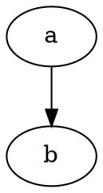

# DOT Parser Requirements

Status: living requirements, amended in place (see §20 Amendments)  
Original draft: 2026-07-13 · Last amended: 2026-09-12

Requirement IDs (`R-*`) are stable and cited throughout the source code:
content may be amended, but IDs are never renumbered, deleted, or reused.

These requirements describe the intended contract, not a claim that every
feature is implemented. [OpenQuestions.md](OpenQuestions.md) separates settled
policy from pending implementation and verification;
[supported syntax](../SUPPORTED_SYNTAX.md) describes current grammar coverage.

## 1. Purpose

Build a reusable DOT-language parser that is independent of Zigraph or any other
graph engine. The library parses DOT input and exposes its structure without
performing layout or forcing the caller to adopt a particular graph model.

Zigraph integration, if built later, belongs in a separate adapter:

```text
DOT source -> DOT parser -> DOT representation -> consumer-specific adapter
                                                   -> Zigraph
                                                   -> another graph library
                                                   -> linter or formatter
```

The parser must not import, reference, or otherwise depend on Zigraph.

## 2. Terminology

The library-facing graph kinds are:

- `digraph`: a directed graph.
- `undigraph`: an undirected graph.

In this project's identifiers, documentation, and prose, *graph* is the
generic term meaning **either** kind; it never means specifically
undirected. Only at DOT-reading time does the source keyword `graph` map to
the public model's `undigraph` value (and `digraph` to `digraph`). This is
an API naming choice and must not change the accepted DOT syntax.

In this document, *syntax tree* or *AST* means the tree representing the DOT
document. It does not imply that the graph described by that document is a
tree. A parsed graph may be cyclic, disconnected, or contain parallel edges.

## 3. Core functional requirements

### R-FUNC-001: Parse both graph kinds

The parser must accept directed and undirected DOT documents and preserve their
kind in its output.



### R-FUNC-002: Build a DOT-specific representation

The retained representation must model DOT concepts rather than the concepts of
a particular layout engine. At minimum, the design must be able to represent:

- The document's graph kind, optional name, and `strict` marker.
- Node statements.
- Edge statements and edge chains.
- Graph, node, and edge attribute statements.
- Key/value assignments.
- Named and anonymous subgraphs.
- Node ports and compass points.
- Attribute lists, including multiple adjacent lists.

The parser must preserve enough information to validate or process the document
without consulting Zigraph.

### R-FUNC-003: Keep syntax parsing separate from graph resolution

Parsing a statement is distinct from applying DOT's graph-building semantics.
Examples of semantic work that must not be accidentally hidden inside unrelated
lexer or parser operations include:

- Expanding an edge whose endpoint is a subgraph.
- Applying scoped default attributes.
- Merging repeated node declarations.
- Applying `strict` duplicate-edge behavior.
- Validating `->` versus `--` against the document kind.

The exact public boundary between syntax parsing, validation, and semantic
resolution remains an API design decision, but these phases must be modular.

### R-FUNC-004: Preserve attribute values without layout interpretation

DOT identifiers and attribute values are strings at the language level. The
core parser must not assign layout-specific meanings to values such as `pos`,
`weight`, `width`, or `rank`.

Numeric-looking values must be preservable as source text or equivalent exact
lexemes. The core parser must not require floating-point support or silently
convert every numeral to a float.

### R-FUNC-005: Useful diagnostics

Failures must be reported as structured data rather than printed or terminated
inside the library. A diagnostic should be able to include:

- Error category.
- Source offset.
- Line and column when source tracking is enabled.
- Unexpected token or byte.
- Expected construct when practical.

Diagnostic richness may be configurable so embedded users do not pay for
metadata they do not need. The parser tracks its current byte offset, physical
line, and byte column as constant-size state. Retaining locations for syntax
nodes is separate and optional.

### R-FUNC-006: Offer syntax and intermediate representations separately

The parser should support two optional retained representations with different
jobs:

- A **syntax tree** that follows source structure and statement order. It keeps
  source spans and may optionally retain tokens, comments, separators, and exact
  quoting for linting, diagnostics, rewriting, and formatting.
- A consumer-neutral **DOT intermediate representation (`DotIR`)** that is easier
  to analyze. It may normalize edge chains, references, attribute scopes, or
  other DOT semantics according to explicitly selected lowering passes.

Neither representation is mandatory for event-only parsing. `DotIR` must remain
independent of Zigraph and useful to linters, documentation generators, graph
analyzers, and future adapters.

The syntax tree is the source of truth for source fidelity. `DotIR` is derived
data and must be rebuildable from syntax data or parser events.

### R-FUNC-007: Diagnostic recovery is policy-driven

The default policy is strict: stop at the first fatal or unrecoverable syntax
diagnostic, while retaining warnings, help, and other non-fatal diagnostics
encountered before that point.

An optional recovery policy may record a recoverable syntax diagnostic,
synchronize at a safe grammar boundary, and continue collecting problems up to
caller-provided diagnostic and work limits. Recovery must be best-effort and
must mark any resulting syntax tree or `DotIR` as partial/invalid. Unterminated
quoted or HTML-like input, lost delimiter balance, and exhausted input may be
unrecoverable even when recovery is enabled.

The caller may configure documented diagnostic classes as abort, report-and-
continue, or ignore. Critical internal failures, memory-safety conditions, and
violated parser invariants cannot be ignored. Recovery machinery should be
compile-time excludable when its code-size cost is material.

### R-FUNC-008: Validation completes with a diagnostic bag

Validation is an analysis pass, not fail-fast syntax control flow. It should
continue after independent document errors and attempt to validate all available
syntax or `DotIR`. A completed validation pass returns both document validity and
the collected diagnostics; completion of the pass does not imply that the
document is valid.

The diagnostic destination is caller policy:

- Direct diagnostic sink with no retained bag.
- Caller-provided fixed-capacity bag.
- Arena-backed bag retained for tooling.
- Filtering sink that ignores selected warnings or promotes configured warnings
  to errors.

Collection is bounded. The policy must define whether capacity exhaustion stops
validation, retains the first diagnostics while counting omitted diagnostics,
or streams additional diagnostics elsewhere. Validation may terminate early for
cancellation, exhausted work/memory limits, corrupt intermediate data, or an
internal invariant failure.

## 4. Modularity requirements

### R-MOD-001: Independent core

The tokenizer, parser, DOT representation, validation, and optional semantic
resolution should be separable modules with narrow public interfaces.

### R-MOD-002: Consumer-defined output

The core parser must support consumers other than an in-memory AST builder. An
event/sink interface is the preferred primitive because it permits streaming or
fixed-memory consumers:

```text
graph start
statement/node/edge/attribute events
subgraph start/end
graph end
```

An AST builder can be supplied as one event consumer. A future Zigraph adapter
must be another consumer or a consumer of the AST; it must not be part of the
parser core.

### R-MOD-003: No built-in filesystem policy

The core must parse from caller-supplied bytes or a small input abstraction. File
opening, path handling, and operating-system error translation belong outside
the core.

### R-MOD-004: Optional capabilities must remain optional

Features that add memory or code-size cost should not be mandatory when they are
not needed. Candidates include:

- Subgraph parsing and retention.
- HTML-like identifier validation.
- Ports and compass-point support.
- Retained AST construction.
- String copying.
- Identifier interning.
- Full line/column indexing.
- Semantic resolution.
- Serialization or source-preserving formatting.
- Numeric conversion helpers.

### R-MOD-005: Compile-time exclusion of optional features

Capabilities with material implementation cost must be selectable at compile
time, not merely ignored through a runtime flag. When a feature is excluded,
its parser routines, storage types, validation logic, and dependencies should be
unreachable so the compiler and linker can remove them from the binary.

A runtime configuration may still disable behavior in a full-feature build, but
that does not satisfy a binary-size zero-cost claim.

### R-MOD-006: Unsupported input is distinct from invalid input

When valid DOT uses a feature excluded by the selected profile, the parser
should report a structured `unsupported_feature` result containing the feature
identifier and source span. This must be distinct from malformed syntax,
capacity exhaustion, observer failure, and cancellation.

Recognition is not validation: an unsupported result marks where processing
stopped and makes no validity claim about the deferred construct or the rest
of the input. The current profile's compatibility boundary is documented in
`docs/SUPPORTED_SYNTAX.md` (Q10).

Providing this distinction requires a small recognition gate for the excluded
construct. The implementation of the feature may be absent, but the profile
must retain enough knowledge to identify its introducer or grammar position. A
profile that removes even this recognition cannot truthfully promise both zero
knowledge of the feature and a feature-specific error; such a profile must
document that it reports only a generic syntax error.

### R-MOD-007: Feature dependencies are explicit

Compile-time configuration must reject incoherent combinations with a clear
build error. For example, a semantic pass that expands subgraph endpoints cannot
be enabled when subgraph syntax is unavailable. Optional features must extend
one parser engine through narrow compile-time policies rather than fork copies
of the grammar.

### R-MOD-008: Components build and compose independently

The source abstraction, lexer, parser/event contract, syntax-tree builder,
`DotIR` lowering, validation, WDP catalog, serialization, and consumer adapters
should be independently buildable components where the toolchain permits. A
consumer must not link the syntax-tree builder, `DotIR`, serializer, rich WDP
messages, or adapters merely to use the event parser.

Composition must occur through documented data and callback contracts rather
than private cross-module state.

### R-MOD-009: Loading and consumption policies are explicit

The API must not conflate input loading, parser execution, retained-data
materialization, semantic lowering, and rendering. These are separate policy
axes:

- **Input:** borrowed contiguous bytes, owned/copied bytes, or a chunked source.
- **Execution:** push/run-to-completion, caller-driven pull, or bounded pumping.
- **Materialization:** events only, compact syntax index, selected side tables,
  complete syntax tree, or complete `DotIR`.
- **Lowering:** eager, on-demand, or explicitly cached semantic results.
- **Rendering/consumption:** entirely owned by the sink or downstream consumer.

The library may provide named active, lazy, and hybrid convenience profiles, but
their behavior must be defined as combinations of these independent policies.

### R-MOD-010: Support push, pull, and bounded progress

The shared parser state machine should permit:

- An **active push driver** that runs and calls a sink until completion, pause,
  cancellation, or failure.
- A **lazy pull driver** through which the caller requests the next event or
  unit of progress.
- A **hybrid bounded driver** that processes at most a caller-provided byte,
  token, statement, event, or work-unit budget before yielding.

These drivers must not require threads. Optional drivers should be independently
excludable when their binary-size cost is material.

Each driver must state exactly what its budget bounds. A token or statement
count alone does not bound bytes scanned: trivia or a single lexeme may be
arbitrarily long. A strict byte/work-bounded driver must be able to yield within
lexical scanning and resume without restarting the construct. The current
private parser's token-at-a-time stepping is groundwork, not a public guarantee
of bounded work or cancellation latency (Q27).

The agreed next direction is optional deterministic work metering, distinct
from source progress, with resumable yield and terminal cancellation. The
[execution-contract draft](../architecture/EXECUTION_CONTRACT.md) proposes the
microstep accounting, callback exclusions, cleanup rules, fixed-storage first
slice, and acceptance tests. It is a design specification, not a shipped API.
The internal scanner and parser now implement separately charged source
examinations, grammar transitions and syntax-event attempts, with partition and
failure-lifecycle tests. Pending work and progress counters compile out of the
ordinary parser. The public parser still runs to completion; fixed-storage
bounded sessions and cancellation are not implemented yet.

### R-MOD-011: Active sinks have transactional lifecycle signals

A direct sink may perform visible work before the parser discovers a later
error. The sink contract must therefore include document lifecycle events or an
equivalent mechanism for `begin`, successful `commit`, and `abort` with reason.
The parser cannot promise to roll back arbitrary consumer side effects; sinks
that require atomic output must buffer, stage, or implement rollback themselves.

Syntax commit means the whole document parsed, not that semantic validation
passed. A consumer requiring validated atomic output must retain control of
its staging through validation as well. A reusable staging helper is deferred
until a concrete consumer justifies its memory and binary cost (Q29).

### R-MOD-012: Lazy behavior has explicit validity guarantees

True on-demand access requires retained input or copied data. A lazy view that
stores source spans must keep the referenced source alive and randomly
accessible. A non-rewindable stream cannot provide later lazy access to discarded
bytes unless those bytes are copied.

The API must distinguish a completely validated document from a partial or
deferred parse. It must not report whole-document success while undiscovered
syntax may remain. Errors produced during deferred decoding or lowering must
retain the same structured diagnostic model as eager errors.

### R-MOD-013: Cancellation is cooperative and platform-neutral

The parser must support optional cooperative cancellation checked at documented
safe points. The core receives a caller-owned cancellation hook or token policy;
it does not install signal handlers, spawn a monitor thread, or require atomics.
A hosted adapter may use an atomic flag that an OS signal handler or another
thread sets, while a freestanding caller may use an ordinary flag or callback.

Cancellation is a terminal caller request and triggers sink abort semantics. A
bounded-driver yield is not cancellation and remains resumable. Callers must be
able to disable cancellation checks when they do not want their hot-path cost.

## 5. Memory requirements

### R-MEM-001: Explicit memory only

Every operation that may need storage must receive that storage or an allocator
explicitly. The library must perform no hidden heap allocation and must not rely
on a process-global allocator.

### R-MEM-002: Support three useful lifetimes

The design must work naturally with three caller-controlled memory lifetimes:

- **Temporary:** token decoding, escape handling, and parser scratch state;
  frequently reset.
- **Mid-term:** AST nodes, attributes, and subgraph data retained for the life of
  one parsed document.
- **Long-term:** identifiers or converted graph data deliberately retained by
  the application beyond the parsed document.

The API should express ownership and lifetime requirements clearly. It should
not require that all three lifetimes use a specific arena implementation; fixed
buffers, arenas, pools, or general allocators are caller policy.

### R-MEM-003: No-allocation operation

The library must have a mode that performs no dynamic allocation. This means it
uses caller-provided fixed storage and/or emits events without retaining an
arbitrarily large AST.

Because an arbitrary input can contain arbitrary nesting and arbitrarily many
statements, fixed-memory operation must fail predictably when a configured bound
is exceeded. Expected failure categories include:

- Insufficient scratch memory.
- Output capacity exceeded.
- Token too large for the configured buffer.
- Nesting depth exceeded.

No-allocation does not mean unlimited retained output without storage.

### R-MEM-004: Explicit source ownership modes

The API must make lexeme ownership unambiguous. It should be possible to offer:

- **Borrowed input:** retained nodes refer to slices of input kept alive by the
  caller.
- **Copied input:** selected or all lexemes are copied into caller-provided
  storage.
- **Transient event input:** event lexemes are valid only for a documented
  callback duration.

### R-MEM-005: Bulk release must be efficient

The design must allow a whole parse result to be discarded by resetting or
destroying its mid-term arena/pool, without requiring a recursive per-node
destruction walk.

### R-MEM-006: Support decomposed, index-based retained data

Retained syntax and intermediate data should be decomposable into independently
allocated pools or side tables rather than require a pointer-rich object graph.
Candidate storage includes:

- Dense node/statement records addressed by integer IDs.
- Separate pools for edges, attributes, subgraphs, spans, and optional trivia.
- Contiguous ranges for ordered children where practical.
- Borrowed source slices instead of copied strings.
- Optional side tables for resolved attributes, lint facts, documentation data,
  and source-preservation metadata.
- Chunked pools whose chunks can be supplied, retained, or released separately.

Index width may be configurable when that materially reduces embedded memory,
provided overflow is checked. Disabling an optional side table must remove its
retained-memory cost.

### R-MEM-007: Fragment composition has explicit semantics

Syntax fragments may be parsed and stored independently, but combining lowered
fragments must explicitly reconcile statement order, scoped defaults, subgraph
membership, graph kind, node identity, and local IDs. The library must not imply
that arbitrary independently lowered fragments can be concatenated without a
merge/lowering phase.

### R-MEM-008: Source-location retention is optional

Current byte offset, line, and byte-column counters require only constant parser
state. Diagnostics copy or stream the small location they need. Per-token and
per-node spans, source excerpts, line indexes, and Unicode/display columns must
live in optional caller-provided side tables or tooling components. They can be
omitted from a build, reset with an arena, or discarded after diagnostics have
been rendered.

## 6. Performance requirements

### R-PERF-001: Predictable, near-linear parsing

Normal parsing should be single-pass or near single-pass and scale linearly with
input size. The design must avoid unnecessary intermediate strings, repeated
rescans, and eager graph expansion.

### R-PERF-002: Avoid recursion tied to input size

Untrusted or deeply nested input must not be able to exhaust the machine call
stack. Prefer iterative state machines or an explicit caller-bounded parser
stack for nesting-sensitive work.

### R-PERF-003: Do not eagerly expand compact DOT constructs

Edge chains and subgraph endpoints may describe many semantic edges. The syntax
representation should retain their compact form unless a caller explicitly asks
for expansion.

### R-PERF-004: Make costs measurable

Before declaring performance complete, the project must define benchmarks for:

- Bytes parsed per second.
- Peak temporary and retained bytes.
- Bytes per AST node/statement where applicable.
- Behavior on long identifiers, large attribute lists, edge chains, and deep
  subgraphs.
- Fixed-capacity failure paths.

Initial measured baselines are recorded in `docs/BASELINES.md` and are
reproducible via `zig build bench -Doptimize=ReleaseFast`. Concrete numeric
*budgets* (pass/fail thresholds per profile) are still to be decided.

### R-PERF-005: Define what “do not pay” means

Every optional-feature claim must state which costs disappear when disabled:

- Binary code and read-only data size.
- Runtime branches or callbacks on the hot path.
- Parser-state and scratch-memory size.
- Retained-output memory.
- External dependencies or platform requirements.

These are separate properties. For example, borrowed AST mode may eliminate
copied-string memory without eliminating AST code, while compile-time exclusion
may eliminate code but retain a tiny unsupported-feature detector. Representative
build profiles must track binary size and parser-state size as regressions.

### R-PERF-006: Lazy work is performed at most once when cached

On-demand decoding or lowering must not accidentally turn repeated queries into
unbounded repeated parsing. APIs must state whether a lazy result is recomputed,
cached in caller-provided memory, or consumed once. Caches remain optional and
must use explicit memory.

## 7. Portability and embedded requirements

### R-PORT-001: Non-OS operation

The core must be usable in a freestanding or bare-metal environment:

- No required filesystem.
- No required threads.
- No required environment variables.
- No required process-global initialization.
- No required standard I/O streams.
- No required floating-point unit.

### R-PORT-002: Small-device viability

A Longan Nano-class target is a design constraint. The parser must therefore
permit fixed capacities, reduced diagnostics, bounded nesting, and event-only
operation. Actual device RAM and flash budgets must be recorded once the target
board and build configuration are fixed.

### R-PORT-003: Deterministic behavior

For identical input and configuration, parsing and validation results must not
depend on hash randomization, locale, host floating-point behavior, filesystem
state, or thread scheduling.

### R-PORT-004: Fixed-point conversion is outside the parser core

If consumers need deterministic numeric values, optional helpers may support
types such as Q16.16 or Q32.32. This is separate from recognizing DOT numerals
and must not force fixed-point or floating-point representation on the AST.

### R-PORT-005: Public ordering is deterministic

Public traversal must not expose hash-table or thread-scheduling order. Source-
shaped data preserves source order. Derived collections and merged fragments
must define a stable order or require the caller to request an explicit sort.
Diagnostics should default to source position, followed by deterministic
emission order for diagnostics at the same position. Exact ordering promises
for nodes, edges, attributes, and lowered data must be documented with their
APIs.

### R-PORT-006: The core is byte-oriented and encoding-extensible

The core recognizes DOT's ASCII structural bytes and preserves identifier and
attribute payloads as raw byte slices. Version 1 does not require Unicode
normalization or transcoding in the parser. Encoding validation is a separable
policy or pass so users who do not request it do not link its tables or code.

UTF-8 and Latin-1 are ASCII-compatible and can share the byte-oriented lexer.
An optional UTF-8 validator may reject or report invalid sequences without
changing stored lexemes. Latin-1 interpretation or transcoding may be added
later over the same raw bytes. UTF-16 is not an input encoding of the byte lexer;
support would require an explicit decoding source adapter, with clearly defined
mapping between original and decoded source offsets.

Physical line tracking treats LF, CRLF, and standalone CR according to one
documented policy while preserving byte offsets. Canonical byte column counts
bytes; a tab therefore advances it by one byte. Configurable tab stops and
Unicode display-cell columns belong to diagnostic presentation, where the
original line can be expanded for a terminal or editor.

## 8. Diagnostic requirements

### R-DIAG-001: Use WDP diagnostic identities

All parser diagnostics must use Waddling Diagnostic Protocol (WDP)
structured codes and, where useful, their precomputed compact IDs. The WDP
part 7 namespace `dot_parser` is the error boundary carrying the library's
identity; the component names the internal module that reported the
diagnostic (`Lexer`, `Parser`, `Validation`, `Resource`, `Profile`, and
later `Observer`/`Internal`); the primary names the failure domain within
that component. Sequence numbers follow the WDP part 6 conventions.
Rendered codes may show the fully qualified form
(`dot_parser:E.Parser.Syntax.003 -> nshash-codehash`).

The WDP sequence and its meaning must be documented in an authoritative source
such as the project diagnostic registry or generated catalog.

### R-DIAG-002: Use the severity alphabet semantically

The project must not classify every diagnostic as `E`. WDP severities should be
used according to their meaning:

- `C`: critical internal corruption or invariant failure.
- `E`: an operation failed, including invalid syntax or an unsupported required
  feature.
- `W`: recoverable or tolerated input that deserves attention.
- `B`: progress is blocked pending input, capacity, or another documented
  prerequisite.
- `I`: informational state or selected-profile information.
- `T`: opt-in lexer/parser tracing.
- `H`: actionable help associated with another diagnostic.
- `S`: successful result when a success diagnostic is useful.
- `K`: completion of a longer operation or pass when distinct from success.

Severities must not be emitted merely to exercise every letter. Each use must
match WDP semantics, and non-failure severities must not be represented as
language-level errors.

### R-DIAG-003: Separate diagnostic identity from control flow

A parser result must distinguish success, need-more-input, cancellation,
invalid syntax, unsupported feature, configured limit, memory exhaustion, sink
failure, observer failure, and internal failure. A WDP code explains a specific
diagnostic; it must not replace the small control-flow result needed by callers.

Warnings, information, trace, help, success, and completion events may accompany
a successful operation. Failure outcomes must identify the control-flow cause
even when no diagnostic is retained or delivered. Diagnostic delivery status is
separate from the operation's outcome; callers must inspect both. Not every
failure has a diagnostic: the current internal storage-failure fallback emits
none, and the private event sink owns the cause of its own failures. Per-code
payload and delivery contracts are documented in `docs/OUTCOMES.md`; these
exceptions must be explicit rather than inferred from an empty bag.

### R-DIAG-004: Rich messages and catalogs remain optional

The core may carry a compact enum/integer diagnostic identity, WDP compact ID,
source span, and typed fields without linking human-readable message templates,
catalog loading, localization, JSON, or runtime hashing. Structured codes,
compact IDs, and catalogs should be generated or validated at build time where
possible.

### R-DIAG-005: Current codes remain coherent and testable

The build or test suite must detect duplicate structured identities, catalog
drift, invalid severity assignments, and compact-ID collisions within the
current project catalog. Within the package namespace, an identity consists of
severity, component, primary, and sequence; a sequence number alone is not
globally unique and may recur across domains. Canonical sequence numbers and
aliases are defined together in `diagnostic.Sequence`, with registry metadata
derived from those pairs.

During initial experimental `0.x` development, backward compatibility is not
required for diagnostic identities or typed payload enums. Remove obsolete
codes, implemented-feature detectors, display entries, and compatibility-only
scaffolding rather than preserving old discriminants or replay behavior. Add
outcomes when their behavior is implemented, not to reserve future API slots.
Current enums and retained layouts are not cross-version serialized formats.
A future stability guarantee requires an explicit decision; it is not implied
by the existing experimental release.

### R-DIAG-006: Pin the WDP specification version

The project must document which WDP specification version and conformance level
its codes follow. Upgrading that baseline requires conformance review and
regeneration or validation of structured codes, compact IDs, catalogs, and
tests. Parser users must not need a runtime WDP implementation merely to inspect
a diagnostic identity.

## 9. Observability requirements

### R-OBS-001: Pluggable observer interface

The library must allow a caller to supply an optional observer through a small,
documented interface. The observer may adapt events to the caller's logging,
tracing, metrics, or diagnostic framework. The parser must not depend on a
specific logging package.

### R-OBS-002: Structured events, not preformatted log strings

Observer events should contain stable event kinds and typed fields such as
source spans, counters, graph depth, token kind, and error category. Formatting,
timestamps, destinations, log levels, and message retention belong to the
caller. This prevents hidden formatting allocations and allows the same parser
to work with desktop, embedded, and no-allocation logging systems.

Useful event categories may include:

- Parse start, completion, cancellation, and failure.
- Capacity and configured-limit failures.
- Diagnostics emitted.
- Optional lexer or statement progress at a verbose level.
- Summary counters such as bytes, tokens, statements, and maximum depth.

The initial event set and verbosity controls are still an API design decision.

### R-OBS-003: Disabled observability has negligible cost

When no observer is installed, observability must perform no allocation and no
formatting. Hot-path branches and event construction should be minimized and
measured. Builds intended for extremely constrained targets should be able to
compile out verbose instrumentation.

### R-OBS-004: Observability must not change parsing semantics

For a given input and configuration, attaching an observer must not change the
AST, event stream, validation result, or memory ownership. An observer may
request explicitly supported cancellation or return an observer error; such an
exit must be reported distinctly from invalid DOT and capacity exhaustion.

### R-OBS-005: Source data is private by default

Events must not include complete input, arbitrary identifier contents, or
attribute values by default. Callers may explicitly opt into source excerpts.
This is important because DOT input may contain secrets, internal names, URLs,
or user-controlled terminal sequences.

### R-OBS-006: Observer lifetime and callback rules are explicit

The interface must document the observer context lifetime, event-field
lifetimes, whether callbacks may re-enter the parser, and how callback failures
propagate. The default contract should prohibit re-entry into the same parser
instance while a callback is active.

## 10. Security requirements

### R-SEC-001: Treat every input as untrusted

The parser must make no assumption that the input was produced by Graphviz or a
trusted application. Invalid bytes, truncated tokens, extremely long tokens,
deep nesting, huge statement counts, and deliberately pathological structures
must all fail safely and predictably.

### R-SEC-002: Resource consumption is bounded by policy

Callers must be able to limit at least:

- Input bytes when using a stream.
- Token or lexeme length.
- Nesting depth.
- Statement and attribute counts when retained.
- Scratch and output memory.
- Work performed by optional semantic expansion.
- Diagnostic and observer event volume.

The exact set of limits may vary by profile, but embedded and server users must
not need to trust the document to remain within a safe budget.

### R-SEC-003: Prevent algorithmic complexity attacks

Normal parsing should remain near-linear even for rejected input. The parser
must avoid uncontrolled backtracking, repeated whole-input rescans, quadratic
string concatenation, and implicit expansion of subgraph edge products. Tests
and benchmarks must include adversarial shapes designed to expose worst-case
time and memory behavior.

### R-SEC-004: Check all size arithmetic

Offset, length, count, capacity, and allocation-size arithmetic must be checked
for overflow and narrowing. Input-controlled values must never be used for
unchecked pointer arithmetic, indexing, allocation, or recursion depth.

### R-SEC-005: Parsed content is data, never executable content

The core must not execute preprocessor lines, resolve URLs, open paths, load
external entities, interpret HTML-like labels as browser HTML, or invoke layout
commands. DOT comments, HTML-like identifiers, escapes, and attributes are
recognized or preserved only as language data. More powerful interpretation
belongs to an explicitly separate consumer with its own security policy.

### R-SEC-006: Minimize and isolate trusted code

Dependencies and platform surface should remain small. Any code requiring raw
pointer manipulation or other memory-unsafe operations must be isolated,
justified, reviewed, and directly tested. The core should not use mutable global
state.

For Zig, low-level casts must have locally documented invariants. Erased
callback context casts must preserve the original type, alignment, and lifetime;
input-derived indices and narrowing conversions require bounds validation or a
documented proof that their domain is safe. Assertions may check internal or
documented caller preconditions, but malformed source bytes must not trigger
them. Any explicit disabling of runtime safety requires a local justification
and direct tests; it is not a substitute for validating untrusted input.

Before adding a dependency, review its safety, allocation behavior, platform
requirements, maintenance exposure, and license compatibility (§17). The current
zero-dependency build is evidence of a small dependency surface, not proof that
all low-level code has been audited (Q13).

### R-SEC-007: Security failures are testable

The test suite must cover malformed input, every configured limit, allocation
failure injection, truncated input at token boundaries, observer cancellation,
integer boundary cases, and fuzz-generated inputs. Regressions should be kept as
permanent tests.

## 11. Architecture and code-quality requirements

### R-ARCH-001: Maintain one parser engine

Desktop, embedded, event-only, borrowed-AST, and owned-AST modes must share one
lexer and parser state machine. Storage policies and sinks may vary, but the DOT
grammar must not be duplicated across profiles.

### R-ARCH-002: Enforce dependency direction

Dependencies must flow from small language primitives toward optional features:

```text
source abstraction -> lexer -> parser -> event/sink contract
                                      -> AST builder
                                      -> validation/resolution
                                      -> optional adapters
```

The lexer must not depend on an AST. The parser must not depend on a particular
AST builder, logger, allocator implementation, graph engine, or OS service.
Adapters must depend inward on public parser contracts; the parser must never
depend outward on adapters.

### R-ARCH-003: Explicit state, ownership, and errors

Public APIs must make parser state, input lifetime, output ownership, memory
provider, limits, observer, and error propagation visible. Hidden singleton
state and undocumented borrowed references are prohibited.

### R-ARCH-004: Keep responsibilities narrow

Lexing, syntax parsing, validation, semantic resolution, storage, observation,
serialization, and consumer adaptation must have distinct responsibilities.
Combining modules for code-size reasons is allowed only when their public
contracts and tests remain separable.

### R-ARCH-005: Design for isolated testing

Each layer must be testable without the layers above it. Required test seams
include:

- Feeding bytes or chunks without filesystem access.
- Inspecting lexer tokens independently.
- Driving the parser with a recording or rejecting sink.
- Injecting small/failing memory providers.
- Installing a recording, cancelling, or failing observer.
- Running validation independently over constructed syntax data.

### R-ARCH-006: Keep the public surface small and documented

Public types should expose stable concepts rather than implementation details.
Every public ownership rule, source-span lifetime, callback restriction, limit,
and error category must be documented. Convenience APIs may wrap the core but
must not weaken its guarantees.

### R-ARCH-007: Quality gates are part of development

Changes to grammar or parser state must include focused tests. The project
should maintain formatting, static-analysis, unit, integration, fuzz-regression,
and benchmark checks appropriate to the implementation toolchain. Performance
or memory optimizations must preserve correctness tests and should include
before/after measurements.

### R-ARCH-008: Concurrency does not infect the core

The core parser must not require a thread runtime, locks, atomics, or background
workers. Concurrency support must be layered so freestanding and single-threaded
builds do not link synchronization machinery.

### R-ARCH-009: Compatibility surfaces are versioned deliberately

The project must distinguish and document its compatibility surfaces:

- Public source API and compile-time feature/profile names.
- Any promised binary ABI.
- WDP diagnostic identities, severities, and metadata fields.
- Serialized syntax-tree, `DotIR`, cache, or catalog formats.
- Accepted DOT behavior and compatibility exceptions.
- Minimum supported compiler/toolchain and target profiles.

During the initial experimental `0.x` phase, backward compatibility is not
promised, including for WDP identities and diagnostic payloads, and breaking
changes are expected. Do not retain compatibility-only code for this phase.
Releases must state that status clearly; no stable binary ABI or retained-tree
serialization is implied. Once a
stable compatibility boundary is declared, semantic versioning should govern
published source APIs and any separately declared diagnostic guarantees. A
future public serialized format must carry its own version and define
endianness, index width, and compatibility behavior; internal memory layouts are
not serialized formats.

### R-ARCH-010: Preserve a path to incremental parsing

Incremental editor parsing is planned for a later phase, not version 1. Version
1 should avoid unnecessary barriers by using source spans, explicit ownership,
separable syntax data, and deterministic IDs where practical. It does not need
to implement edit tracking, persistent trees, subtree reuse, or diagnostic
remapping yet.

## 12. Concurrency requirements

### R-CON-001: Thread-compatible independent instances

Separate parser instances with separate state, input, memory, sinks, and
observers must be usable concurrently. There must be no shared mutable global
parser state.

### R-CON-002: A parser instance has one active owner

The library does not need to make simultaneous calls into the same parser
instance safe. A parser instance, its temporary memory, and its mutable builders
have one active owner unless a future type explicitly documents otherwise. This
avoids locks and keeps embedded costs predictable.

### R-CON-003: Frozen retained data may be shared

A completed syntax tree or `DotIR` should be readable concurrently when its
backing memory and borrowed source remain alive and no mutation occurs. Mutable
side tables and incremental builders require separate ownership or external
synchronization.

### R-CON-004: Parallel work is optional and external

Applications may parse separate documents or independent syntax fragments on
different threads. Optional parallel lowering, linting, or documentation passes
may be implemented later as separate components. Single-document syntax parsing
is not required to spawn internal workers, because ordered statements and
scoped defaults make it substantially sequential.

### R-CON-005: Determinism survives concurrency

Results must not depend on scheduling. A merge step for independently produced
fragments must define deterministic ordering, ID remapping, and diagnostic
ordering.

## 13. Robustness requirements

### R-ROB-001: Never crash on invalid input

Malformed or adversarial input must produce a bounded error, not an assertion,
out-of-bounds access, integer overflow, or infinite loop.

### R-ROB-002: Explicit limits

All resource limits relevant to fixed-memory operation must be caller-visible
and testable. The library must distinguish invalid syntax from exhausted caller
capacity.

### R-ROB-003: Reentrant state

Parser state must be instance-owned. Independent parser instances must be usable
without shared mutable global state.

### R-ROB-004: Test against the language and real inputs

Testing should include:

- Each grammar production.
- Directed and undirected operator rules.
- Quoted, numeral, bare, and HTML-like identifiers.
- Comments, optional separators, and escaped newlines.
- Subgraphs, attribute scoping, ports, and edge chains.
- Malformed and truncated input at every token boundary.
- Capacity exhaustion and nesting limits.
- Fuzzing and differential tests against Graphviz where behavior is intended to
  be compatible.

## 14. Initial non-goals

Unless later promoted to requirements, the parser core will not:

- Perform graph layout.
- Depend on Zigraph.
- Interpret Graphviz layout attributes.
- Open files or allocate from an OS heap on behalf of the caller.
- Require floating-point arithmetic.
- Automatically normalize the AST into a consumer's node/edge structures.
- Promise lossless source formatting or comment preservation.
- Spawn threads or require a threading runtime in the parser core.
- Provide incremental editor re-parsing in version 1.

## 15. How these requirements compare with other DOT parsers

The following comparison is an architectural inference from the linked projects
and documentation, not a claim about every DOT parser.

### Common priorities

1. **DOT syntax coverage and Graphviz compatibility.** The official language has
   deceptively complex corners: four ID forms, HTML-like strings, three comment
   forms, optional separators, concatenated strings, ports, subgraphs as edge
   endpoints, edge chains, and scoped defaults. Correctness here is the dominant
   shared concern. See the [official DOT language specification](https://graphviz.org/doc/info/lang.html).

2. **A useful graph or AST representation.** Gonum keeps a dedicated DOT AST and
   separates syntax-related packages from semantic processing; its source tree
   also includes fuzzing and test data. See [Gonum's DOT package](https://github.com/gonum/gonum/tree/master/graph/formats/dot).

3. **Integration and round-tripping.** Many popular libraries optimize for
   convenience inside an existing ecosystem. [pydot](https://github.com/pydot/pydot)
   parses into editable Python graph objects, writes DOT, invokes Graphviz, and
   converts to NetworkX. [graphlib-dot](https://github.com/dagrejs/graphlib-dot)
   describes itself specifically as a parser/writer for graphlib. This project's
   strict consumer independence is therefore valuable but not universal.

4. **Robustness and compatibility testing.** Mature implementations accumulate
   regression suites because real Graphviz behavior contains details beyond the
   compact abstract grammar. Fuzzing, malformed-input tests, and differential
   testing are normal high-value investments.

5. **Diagnostics and security robustness.** General parsing libraries and
   developer tools care about locating invalid syntax and surviving malformed
   input, although the amount of recovery, resource control, and source detail
   varies by use case.

### Less common or distinguishing priorities

1. **Hard no-hidden-allocation operation** is unusual among high-level DOT
   libraries. pydot uses Python objects and pyparsing; graphlib-dot targets
   JavaScript graphlib objects; Gonum builds Go data structures. They emphasize
   usability and integration more than caller-budgeted memory.

2. **Bare-metal and non-OS support** is not a normal headline goal for DOT
   parsers. An event-first, caller-buffered API would distinguish this library.

3. **Three explicit memory lifetimes** are uncommon as a public DOT-parser
   contract. However, the idea has strong precedent in Graphviz itself:
   [libcgraph's memory discipline](https://graphviz.org/pdf/cgraph.3.pdf) permits
   caller-supplied allocation, and the
   [Cgraph tutorial](https://graphviz.org/pdf/cgraph.pdf) explicitly discusses
   arenas/pools and freeing a whole graph at once. Cgraph also provides an I/O
   discipline, which supports the same separation from concrete file APIs.

4. **Deterministic fixed-point-friendly conversion** is a consumer or embedded
   priority, not normally a lexer/parser priority. Keeping numeric IDs exact and
   uninterpreted in the core is nevertheless aligned with DOT: the official
   specification defines IDs as strings and says numeric and quoted forms have
   no semantic difference.

5. **A logging-framework-neutral observer contract** is not normally a headline
   DOT-parser feature. Structured, allocation-neutral events are particularly
   useful here because the same core is expected to run in environments ranging
   from bare metal to server applications.

### Conclusion of the comparison

The language-correctness, AST, diagnostics, and robustness requirements are
standard and necessary. The explicit-memory, event-first, bare-metal, bounded,
and deterministic requirements are the project's distinctive contribution.
They are reasonable, but they must shape the first API and test suite; adding
them after an allocation-heavy AST implementation would be expensive.

## 16. Open design decisions

Moved to [OpenQuestions.md](OpenQuestions.md), which tracks every question's
status — decided, partially decided, or open — with the decision and where
it is embodied. Question numbering (Q1–Q29) is preserved there and remains
stable; new questions append with fresh numbers.

## 17. Licensing requirements

The project is dual-licensed under the MIT License and Apache License 2.0 using
the SPDX expression:

```text
MIT OR Apache-2.0
```

Source files and package metadata should use consistent SPDX identifiers.
Contributions must be accepted under both licenses, and required third-party
dependencies must have licenses compatible with distribution under this dual
license. Dependency license review belongs in release checks.

## 18. Suggested acceptance profiles

To prevent desktop convenience from weakening embedded guarantees, validation
can be organized into profiles:

- **Core event profile:** fixed caller storage, no dynamic allocation, no OS,
  bounded nesting, structured events.
- **Selected-syntax profile:** compile-time feature set with structured
  unsupported-feature errors for excluded constructs.
- **Borrowed AST profile:** retained AST whose lexemes borrow the complete input.
- **Owned AST profile:** retained AST and copied lexemes using explicit
  caller-provided memory.
- **Full tooling profile:** rich diagnostics, pluggable observation, validation,
  optional serialization, fuzzing, security limits, and compatibility tests.

The core event profile should remain the lowest common denominator.

## 19. Developer experience requirements

Ergonomics is a design surface with binding requirements, not taste. These
requirements codify the decisions of the DX design pass; none of them may
weaken a core guarantee (R-ARCH-006: convenience wraps the core without
weakening it).

### R-DX-001: Progressive disclosure in layers

The public API is organized in levels, each serving a distinct consumer:

1. One-call façade for applications.
2. Staged parse/validate plus document traversal for linters and tooling.
3. Fixed and deterministic-storage APIs for embedded targets.
4. Resumable/bounded drivers (when published).
5. Intermediate representation and engine adapters (when published).

Descending a level adds control without invalidating concepts learned
above: the same vocabulary — document, sink, bag, outcome — appears at
every level. Deeper layers are never gated behind the façade.

### R-DX-002: One uniform reporting surface

Parsing, validation, and future analysis phases use one reporting surface:
diagnostics flow into a caller-owned sink, and control-flow results carry
small typed outcomes and
delivery status rather than diagnostic payloads. Current fail-fast parsing
attempts at most one failure diagnostic; complete validation attempts one per
independent violation. Retention depends on the sink: a discard sink, full bag,
or failed delivery can leave no retained entry, and documented failures may
emit no diagnostic (R-DIAG-003). Recovery may increase entry counts without
changing this surface. Low-level lexer results may carry a diagnostic for the
parser to forward; they are not a second parse/validation reporting API.

Filtering diagnostics changes reporting, not the validity of the document.
Rule-level policy that changes validity must be explicit and separate from sink
filtering; the current validator does not yet expose that policy.

### R-DX-003: Results are data and lose nothing

Public operations return result values whose advanced fields are ignorable
in the simple case but always present: outcome category, diagnostic
delivery status, and phase results are never discarded for ergonomic
convenience. Zig error unions must not serve as the primary failure channel
where they would strip structured diagnostic payloads.

### R-DX-004: Defaults are valid, disposal is explicit

Every public options struct accepts `.{}` with safe, documented defaults.
Where a caller opts out of a safety-relevant facility, the opt-out is a
named, greppable construct (for example the discard diagnostic sink), never
a hidden overload or silent default.

### R-DX-005: Misuse is removed structurally

Where a misuse can be made unrepresentable at acceptable cost, it must be —
documentation is the fallback, not the default. Standing examples that must
be preserved: non-owning views expose no free operation; document/source
pairings are unforgeable; terminal operations are idempotent; publicly
constructible identifiers are bounds-checked; compile-time contract
assertions produce readable errors naming the violation.

### R-DX-006: Costs are inspectable at the call site

Memory and capacity costs are visible where they are incurred: fixed
storage declares capacity in types and exposes its byte size; capacity
failures name the exhausted resource and its limit; growth-based paths
document their allocation behavior. No convenience API may hide a material
cost.

### R-DX-007: Vocabulary is stable and typed

Public concepts use the project vocabulary (§2) consistently across API,
diagnostics, documentation, and examples. Machine-consumed values are typed
enums and identifiers — never strings a consumer would match on — and
renderers own all wording (localization-ready by construction).

### R-DX-008: Examples are API surface

Each disclosure level maintains at least one runnable example and a
documented journey path. Examples are built by the standard build steps so
they cannot silently rot; what an example teaches is treated as a
compatibility surface, because examples are what consumers copy.

## 20. Amendments

Requirement IDs are stable: content may be amended, but IDs are never
renumbered, deleted, or reused. Superseded text is corrected in place and
recorded here.

- 2026-07-17 — **R-PERF-004**: initial baselines recorded
  (`docs/BASELINES.md`, `zig build bench`).
- 2026-07-18 — **§2**: terminology refined — *graph* is the generic kind
  term, never specifically undirected. **§16**: open questions split out to
  `OpenQuestions.md` with stable Q-numbering.
- 2026-07-18 — **§19 added**: developer-experience requirements
  (R-DX-001 … R-DX-008) codifying the DX design pass; Amendments moved to
  §20.
- 2026-07-18 — **R-DIAG-005**: introduced an early cross-version diagnostic
  stability policy; superseded by the experimental-phase decision below.
- 2026-09-12 — **Reconciliation after comments**: distinguished intended
  requirements from shipped coverage; clarified unsupported recognition
  (R-MOD-006), token versus bounded work (R-MOD-010), syntax commit versus
  validated atomic output (R-MOD-011), outcome/delivery and optional diagnostics
  (R-DIAG-003/R-DX-002), diagnostic identity scope and paired sequence aliases
  (R-DIAG-005), and the Zig low-level/dependency policy (R-SEC-006). Sink
  filtering does not alter validity. Question decisions and remaining work are
  recorded in `OpenQuestions.md`; no requirement IDs changed.

- 2026-09-12 — **R-DIAG-005/R-ARCH-009**: removed the premature diagnostic
  stability exception. No backward-compatibility scaffolding is required while
  the library is experimental and has no users; keep only current behavior.
